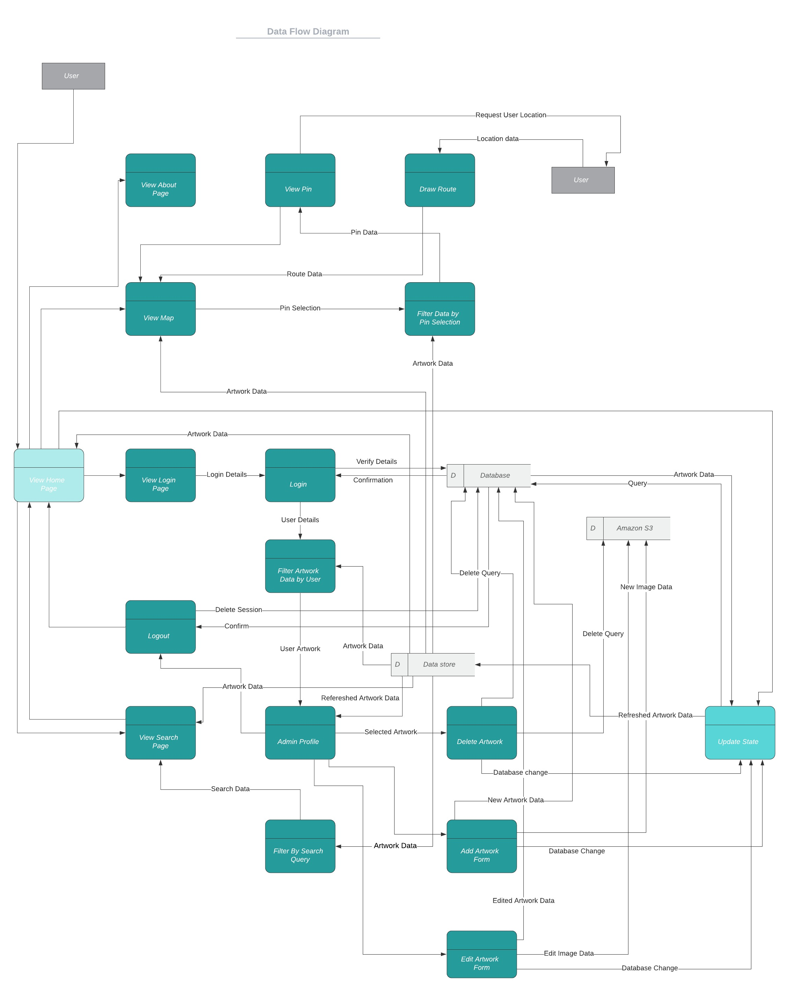
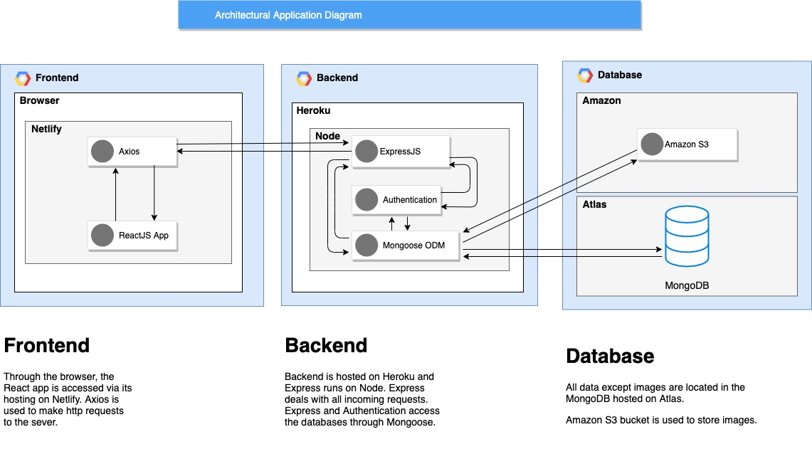

# T3A2-A - MERN Application (Part A)
A group project between Alisa Blakeney and Tom Dunstan

## R1. Description of your website, including:
- Purpose
- Functionality / features
- Target audience
- Tech stack	

This application displays the location of public artworks in City of Melbourne. It can be used to navigate between artworks and learn more about each. It has three main views: 
1. a landing page with a scan-and-scrollable map that shows the user's location and pin markers at the location of each artwork.
2. an about page with information about the public art collection, and with a colophon. 
3. a search view with an open text field that searches the title and artist of the artwork [with the option to view all as an alphabetically sorted list]

From the map view or the search results view, you can navigate to see a page with a photograph of the artwork and the metadata including title, artist, location, date, materials. 

Registered administrators can log in to add additional artworks to the database, and edit or delete artworks they have added. 

### Additional features:
- wayfinding (find the best route from you to another artwork, from one artwork to another)
- regular users can login to create a "favourites list" of artworks

### The target audiences are: 
- Local residents interested in finding out more information about the artworks in their home town.
- Tourists interested in learning about the culture of the town they are visiting.
- Those with an academic interest in art, wanting a basic entry point into researching individual public artworks

### Tech stack

Frontend:
- React
- Axios
- Turf JS
- Netlify

Backend:
- Node
- Express
- Mongoose
- MongoDB
- Express Session
- Passport
- AWS S3
- Heroku
- Atlas

Testing:
- Jest

Source Control:
- Git
- GitHub

Documention and Planning:
- Trello
- Figma
- Lucid Chart
- Diagrams.net

---
## R2. Dataflow Diagram	

---
## R3. Application Architecture Diagram

---
## R4. User Stories	

---
## R5. Wireframes for multiple standard screen sizes, created using industry standard software	

---
## R6. Screenshots of your Trello board throughout the duration of the project	

Week 1

Week 2

Week 3

Week 4
